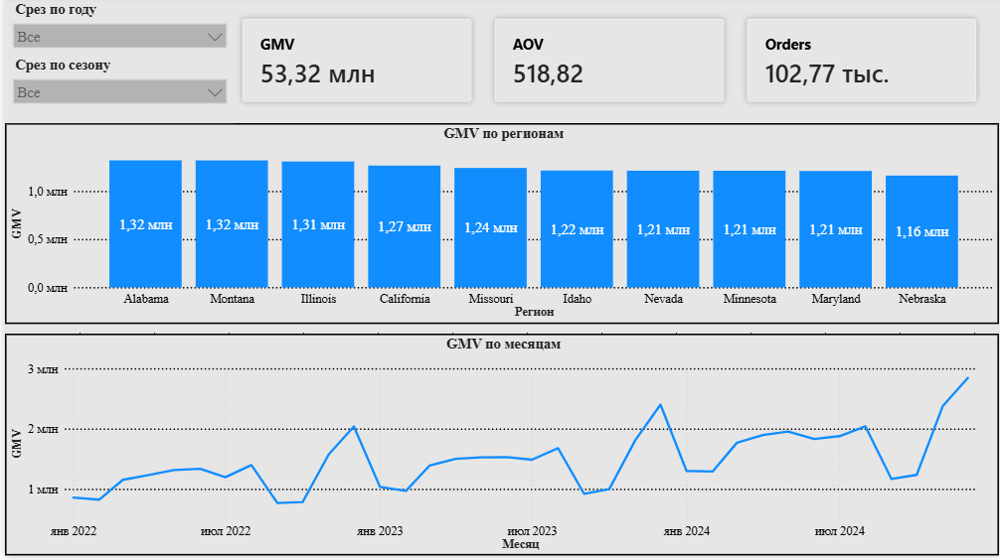
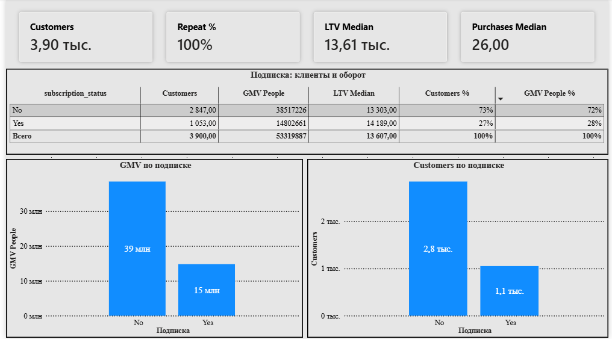

# Clothing Store Sales

Пет-проект: e-commerce аналитика от CSV до дашборда Power BI.  
Датасет: https://www.kaggle.com/datasets/timcii/clothing-store-sales-data  
Период: **январь 2022 — декабрь 2024**.

Python → MySQL → Power BI. Метрики сверены между слоями.

---

## О чём проект

| Слой | Что делает |
|------|------------|
| **Python** | ETL, people, parquet, контрольные метрики |
| **SQL (MySQL)** | схема, load, sanity, KPI-запросы |
| **Power BI** | дашборд, 2 страницы |

**Маршрут: продажи + клиенты (B)**
- продажи — GMV, AOV, Location, год×месяц
- **B — repeat, LTV, когорты, retention, RFM, подписка**
- C — маржа / топ SKU (в файле нет profit — маржу не считаем)

**Метрики:** GMV = `SUM(purchase_amount)`, AOV = GMV / orders.  
Колонки заказа **нет**: зерно — **строка = одна покупка**, orders = `COUNT(*)` / `len(clean)` (не `nunique` invoice).

---

## Данные и ETL

Исходник: **102 771** строк, 21 колонка, CSV с `sep=";"`.

**Зерно — покупка-строка** (нет `order_id` / invoice).

**Чистка:**
- отмен и status в описании нет
- суммы ≥ 0, фильтр `money > 0` не нужен
- `Purchase Amount (USD)` → numeric, `Purchase Date` → datetime (`dayfirst=True`)

**Ключи** (`pipeline.py`):
- `add_keys` не строим (нечего склеивать)
- `people` — 1 клиент = 1 строка: `orders` = count покупок, `gmv`, `first_order`

---

## Ключевые находки

**Продажи**
- GMV **53 319 887**, purchases **102 771**, AOV **~519**
- Штаты по GMV почти ровные: топ Alabama / Montana / Illinois (~2.5% каждый) — сильной концентрации нет
- Пик месяца: **2024-12** (~2.85M GMV)

**Клиенты**
- **3 900** клиентов; покупок на человека min / median / max = **2 / 26 / 51**
- Repeat **100%** — в выборке нет одноразовых (свойство файла, не ошибка расчёта)
- LTV median **~13 607**
- Подписка: **No ~73%** клиентов и **~72%** GMV; **Yes ~27% / ~28%** — оборот почти пропорционален доле людей; LTV median чуть выше у Yes (14 189 vs 13 303)
- RFM: чемпионы **333** ~652 клиента (~28% GMV); остывшие **R=1** ~33% клиентов (~22% GMV)

Цифры совпадают в `scripts/reports.py`, SQL (`04`–`10`) и карточках Power BI.

---

## Дашборд

Готовый отчёт: `powerbi/Clothing Store Dashbord.pbix`

| Файл | Страница |
|------|----------|
| `powerbi/screenshots/overview.png` | Обзор |
| `powerbi/screenshots/customers.png` | Клиенты |

### Обзор


### Клиенты


- **Обзор** — карточки Оборот / Покупки / Средний чек; линия «Оборот по месяцам»; топ‑10 штатов; срезы год / сезон
- **Клиенты** — карточки Клиенты / Доля повторных / LTV / покупок медиана; таблица и столбцы по подписке

---

## Pipeline

```text
data/EcommData_CSV.csv
        │
        ├─► scripts/pipeline.py   → data/processed/clean.parquet, people.parquet
        ├─► scripts/reports.py    → KPI продаж + клиентов
        ├─► scripts/load_mysql.py → MySQL clothing_store_sales
        ├─► sql/01 … 10           → schema, sanity, keys, KPI
        └─► powerbi/              → .pbix, measures.dax
```

| Файл | Назначение |
|------|------------|
| `scripts/pipeline.py` | load, types, clean, people, parquet |
| `scripts/reports.py` | GMV / AOV / Location / year-month / repeat / retention / RFM / subscription |
| `scripts/load_mysql.py` | parquet → MySQL (+ `subscription_status` на people) |
| `sql/01_schema.sql` | БД `clothing_store_sales` |
| `sql/02`–`06` | sanity, keys, totals, dim, year-month |
| `sql/07`–`10` | repeat, retention, RFM, subscription |


---

## Power BI — модель

- `clean_orders` + `people`
- связь: `people[customer_id]` (1) → `clean_orders[customer_id]` (*)
- ось месяцев: колонка `YearMonth` из `purchase_date`

```dax Меры
GMV = SUM ( 'clean_orders'[purchase_amount] )
Orders = COUNTROWS ( 'clean_orders' )
AOV = DIVIDE ( [GMV], [Orders] )

Customers = COUNTROWS ( 'people' )
Repeat % = DIVIDE ( COUNTROWS ( FILTER ( 'people', 'people'[orders] >= 2 ) ), [Customers] )
LTV Median = MEDIAN ( 'people'[gmv] )
```

---

## Стек

Python (pandas, pyarrow) → MySQL 8 → Power BI Desktop (DAX).

---

## Автор

@cat_main
